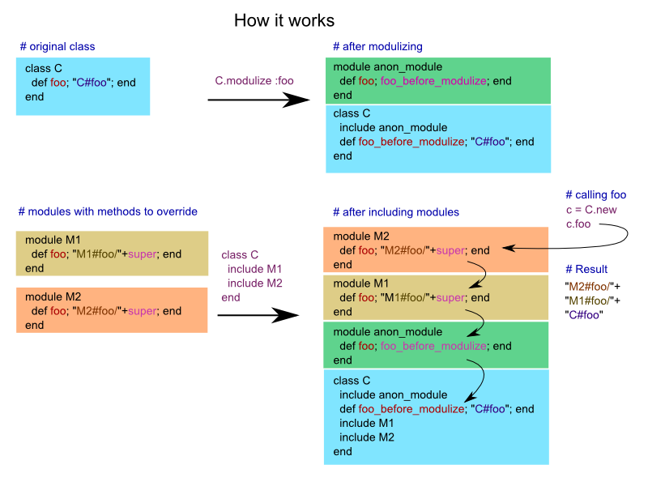

# Modulize

Safe, easy method extension without manual alias_method chaining. Move existing methods into a module for easy overriding with included module methods.

## Goals

 - easy to use
 - no manual alias_method chaining
 - use modules so we can simply call **super** to override with included module instance methods
 - additional extensions can easily be added without possibility of alias_method conflict (only a **single alias_method** is needed for each method, regardless of the number of times it is overriden with modulize)
 - simplify common use case
 - able to effectively reset functionality for testing

## Implementation

## Usage

### For Overriding instance methods

**Given the following class and module with methods to override**

    require 'modulize'

    class C
      def foo
        "C#foo"
      end
    end

    module M1 # module containing methods which we want to override with
      def foo
        "M1#foo/"+super # do our thing then call the original
      end
    end

#### Using by specifying individual methods(s), and manual include

    class C
      modulize :foo # indicate which method(s) to modulize
      include M1
    end

    C.new.foo == "M1#foo/C#foo"

#### Alternate simplified use modulizing all instance methods in module and including the module

    C.modulize_include M1
    C.new.foo == "M1#foo/C#foo"

#### Reverting the modulization specifying methods

Note: This only undoes the alias_method but does not un-include the module(s), but effectively undoes the changes.

    C.unmodulize :foo # reverts method(s) to original call
    C.new.foo == "C#foo"  # back to what orig method did

#### Reverting the modulization for all instance methods in module

Note: This only undoes the alias_method but does not un-include the module(s), but effectively undoes the changes.

    C.unmodulize_modules M1
    C.new.foo == "C#foo"  # back to what orig method did

### For Overriding class methods

**Given the following class and module with class methods to override**

    require 'modulize'

    class CC
      def self.bar  # class method
        "CC#bar"
      end
    end

    module MCC # module containing class methods which we want to override with
      def bar
        "MCC#bar/"+super # do our thing then call the original
      end
    end

#### Using metaclass, specifying individual methods(s), manual include

    class CC
      class << self    # switch into metaclass
        modulize :bar  # indicate which method(s) to modulize
        include MCC
      end
    end

    CC.bar == "MCC#bar/C#bar"

#### Alternate approach using metaclass with modulize_include to modulize all methods in module and including the module

    class CC
      class << self  # switch into metaclass
        modulize_include MCC  # modulize all methods as class methods and include the module
      end
    end

    CC.bar == "MCC#bar/C#bar"

#### Reverting the modulization specifying class methods

Note: This only undoes the alias_method but does not un-include the module(s), but effectively undoes the changes.

    class CC
      class << self  # switch into metaclass
        unmodulize :bar  # revert method(s) back to original call
      end
    end

    CC.bar == "C#bar"

#### Reverting the modulization for all instance methods in module

Note: This only undoes the alias_method but does not un-include the module(s), but effectively undoes the changes.

    class CC
      class << self  # switch into metaclass
        unmodulize_modules MCC  # revert method(s)in the module(s) back to original call
      end
    end

    CC.bar == "C#bar"

## Reasoning - A different approach to extending without manual alias_method chaining

Instead of manually alias_method chaining it would be nice to:

 - be able to extend methods as if they were included as modules
 - even if you didn't write the original source
 - This allows you to simply call super to call the parent implementation
 - Subclassing will work but sometimes you want to modify the existing class because it is used or returned from other methods

Effectively it works like this:

 - Moves the method(s) into an anonymous module and includes it
 - then you can simply include additional modules to override and call super if needed

In reality it is slightly more complicated:

 - we do have to do one single alias_method since we can't unbind the method and move directly
 - but subsequent calls do not need to do anything further
 - This eliminates the potential for aliasing clashes

## References and discussion

 - in aliasing, you have to worry about others using same name for old alias (not unique)
 - <http://whynotwiki.com/Ruby_/_Method_aliasing_and_chaining> - discusses alias chaining and a facet or ActiveSuppport method called alias_method_chain, however still can cause infinite loop and need to know what method to call if you want to delegate up the chain.
 - must check if alias already exists before doing, no guarantee that everyone will use unique feature names
 - Ara Howard suggests this solution to be a nicer alias_method_chain allowing super <http://drawohara.com/post/7241442/ruby-saner-way-to-redefine-methods>
 - Jay Fields mentions a technique to get reference to unbound method, then call it from in a define_method, so that you do not leave any artifacts around like the old method. This involves re-opening the class and defining methods in the class which call to the unbound method. You do not have ability to call old method directly by design and may be difficult to undo. <http://blog.jayfields.com/2006/12/ruby-alias-method-alternative.html>
 - Another blog discussing the unbind technique <http://split-s.blogspot.com/2006/01/replacing-methods.html>
 - Daniel Cadenas implementation of the unbind method with undo - <http://www.danielcadenas.com/2007/11/bit-of-metaprogramming.html>
 - an unbound method retains affinity to the original class so we cannot simply use it in another module directly
 - <http://yehudakatz.com/2010/02/15/abstractqueryfactoryfactories-and-alias_method_chain-the-ruby-way/>
 - Rails 3 prefers to use modules with super to alias_method chains <http://yehudakatz.com/2009/11/12/better-ruby-idioms/> <http://yehudakatz.com/2009/03/06/alias_method_chain-in-models/>
 - Reference to Yehuda Katz Refactoring Rails where methods are used to simplify extension by including modules and calling super. This involves advanced planning and using modules rather than instance methods originally. <http://www.wedesoft.demon.co.uk/no-alias-method-chain.html> (This is probably the closest thing explaining what we are trying to automate)
 - Subclassing or individual class instance extension will work, but sometimes you need to modify the existing class since many of the methods return the same class, like String, Pathname
 - would like to simply use a module with the desired functionality, eliminating all the brittle aliasing and pre-thought about using modules because often the code you want to change is not your own

## Note on Patches/Pull Requests

 - Fork the project.
 - Make your feature addition or bug fix.
 - Add tests/specs for it. This is important so I don't break it in a future version unintentionally.
 - Commit, do not mess with rakefile, version, or history. (if you want to have your own version, that is fine but bump version in a commit by itself I can ignore when I pull)
 - Send me a pull request. Bonus points for topic branches.

## Copyright

Copyright (c) 2010 Jeff Barczewski. See LICENSE for details.

